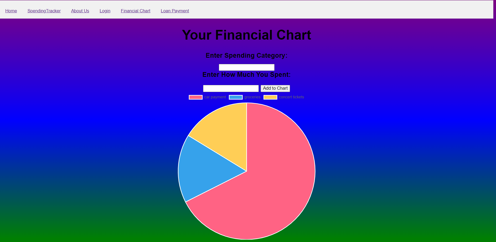

# FinanciallyFit


## Getting started

To make it easy for you to get started with GitLab, here's a list of recommended next steps.

Already a pro? Just edit this README.md and make it your own. Want to make it easy? [Use the template at the bottom](#editing-this-readme)!

## Add your files

- [ ] [Create](https://docs.gitlab.com/ee/user/project/repository/web_editor.html#create-a-file) or [upload](https://docs.gitlab.com/ee/user/project/repository/web_editor.html#upload-a-file) files
- [ ] [Add files using the command line](https://docs.gitlab.com/ee/gitlab-basics/add-file.html#add-a-file-using-the-command-line) or push an existing Git repository with the following command:

```
cd existing_repo
git remote add origin https://gitlab.cci.drexel.edu/fds23/61/team-8/financiallyfit.git
git branch -M main
git push -uf origin main
```

## Integrate with your tools

- [ ] [Set up project integrations](https://gitlab.cci.drexel.edu/fds23/61/team-8/financiallyfit/-/settings/integrations)

## Collaborate with your team

- [ ] [Invite team members and collaborators](https://docs.gitlab.com/ee/user/project/members/)
- [ ] [Create a new merge request](https://docs.gitlab.com/ee/user/project/merge_requests/creating_merge_requests.html)
- [ ] [Automatically close issues from merge requests](https://docs.gitlab.com/ee/user/project/issues/managing_issues.html#closing-issues-automatically)
- [ ] [Enable merge request approvals](https://docs.gitlab.com/ee/user/project/merge_requests/approvals/)
- [ ] [Automatically merge when pipeline succeeds](https://docs.gitlab.com/ee/user/project/merge_requests/merge_when_pipeline_succeeds.html)

## Test and Deploy

Use the built-in continuous integration in GitLab.

- [ ] [Get started with GitLab CI/CD](https://docs.gitlab.com/ee/ci/quick_start/index.html)
- [ ] [Analyze your code for known vulnerabilities with Static Application Security Testing(SAST)](https://docs.gitlab.com/ee/user/application_security/sast/)
- [ ] [Deploy to Kubernetes, Amazon EC2, or Amazon ECS using Auto Deploy](https://docs.gitlab.com/ee/topics/autodevops/requirements.html)
- [ ] [Use pull-based deployments for improved Kubernetes management](https://docs.gitlab.com/ee/user/clusters/agent/)
- [ ] [Set up protected environments](https://docs.gitlab.com/ee/ci/environments/protected_environments.html)

***

## Name
FinanciallyFit project

## Description
Our project allows people to mangage their monthly income through the straightforward 50/30/20 breakdown or a customized breakdown. In addition, they can view their monthly spending through a manually inputed table or pie chart. These allow visualization of their spending habits. Also, there is a loan payment tab that allows users to use the calculator to analyze different loan options. This will allow users to input loan payments into their monthly spending if they forsee that they will need a loan. 


## Visuals
Depending on what you are making, it can be a good idea to include screenshots or even a video (you'll frequently see GIFs rather than actual videos). Tools like ttygif can help, but check out Asciinema for a more sophisticated method.




## Installation
Through GitLab, on our FinanciallyFit project, navigate to the repository.
In the repository, go under the files tab.
Under clone get the link to clone the file.
Install Git on your computer
Clone the GitLab repository for our project using the link. This uses the line git clone git@gitlab.cci.drexel.edu:fds23/61/team-8/financiallyfit.git.
Set up any required environment variables, such as API keys or database credentials to access the git environment.
Configure the database. If the project requires a database, you will need to set up and configure the database according to the project's requirements. This may include creating a new database, configuring the database server, and setting up database users and permissions.
Once the project and all files are on your personal file system, open the file titled "index.html" on your device.
This will open our project and you will be able to see it.

## Usage

50/30/20 breakdown

In the home tab click the button that says "Click here to enter monthly income".
Then enter your monthly income (a number in dollars) in the alert box. For this example I put 5000.

Then click on the button that says "Click here to see the perfect breakdown of spending categories".
Then see the resulting breakdown in the three lines following the buttons.


Customized breakdown

In the home tab click the button that says "Click here to make a customized plan". For this example I put 60.
Enter percentage you want to spend on necessities

Enter percentage you want to spend on wants (refer to the message about how much percentage that you have left to use) For this example I put 30.

Enter percentage you want to spend on savings (refer to the message about how much percentage that you have left to use) For this example I put 10.

Then click on the button that says "Click here to see your custom breakdown"
Then enter your monthly income (a number in dollars) in the alert box. For this example I put 5000.
Then see the resulting breakdown in the four lines below the buttons.


Spending Tracker

Click on the Spending Tracker tab
Enter a name for what you spent money on in the white box below the word Statement. For this example I put car payment
Then enter how much you spent on this category in the white box below the word Spending. For this example I put 250.
Then click on the arrow in the white box below the word Category. Click on the category that best represents this transaction. For this example I put savings.
Then click the submit button

This process can be repeated as many times as needed.
A Spending Summary and Spending table is displayed with all the inputted items
The spending summary shows what percentage of your spending fell into each category
For example I imputed the following items: - groceries:59.90:Needs - concert tickets:60.15:Wants


Financial Chart

Click on the Financial Chart tab
Enter the name of what you spent money in the white box below the words Enter Spending Category
Then enter the amount of money you spent on that item in the white box below the words Enter how much you spent
Then click the button that says Add to Chart
For example I put car payment-250
A pie chart will form to show you your spending habits visually

The process of entering data can be repeated as many times as needed.
The pie chart will update accordingly and change distributions depending on the amount of money spent of each item
For example I imputed the following items: - groceries:59.90:Needs - concert tickets:60.15:Wants


## Support
Contact Information for Developers for Support
  - Megan Ehrnfeldt: mee72@drexel.edu 
  - Savit Tumuluri: sst65@drexel.edu
  - Mehroj Alimov: ma3947@drexel.edu


## Authors and acknowledgment
We would like to thank all those that helped with our project including professors and TAs at Drexel Univerity.
Also special thanks to the authors:
    Megan Ehrnfeldt
    Savit Tumuluri
    Mehroj Alimov


## Project status
The project is currently in development progression.
